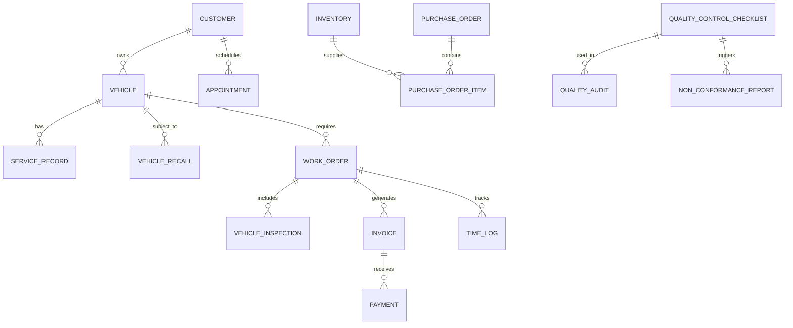

# Database Documentation

## Overview

The Fixit Auto Services database is designed to support all aspects of automotive service management with a focus on data integrity, performance, and scalability.

## Database Schema

### Core Entity Relationships

## Table Reference

### Core Tables

#### `users`
System users with authentication information.

| Column | Type | Description |
|--------|------|-------------|
| id | bigint(20) UNSIGNED | Primary key |
| name | varchar(255) | User's full name |
| email | varchar(255) | Unique email address |
| email_verified_at | timestamp | Email verification timestamp |
| password | varchar(255) | Hashed password |
| role | enum('admin','technician','customer','manager') | User role |
| remember_token | varchar(100) | Remember me token |
| created_at | timestamp | Creation timestamp |
| updated_at | timestamp | Update timestamp |

**Indexes:**
- PRIMARY KEY (`id`)
- UNIQUE KEY `users_email_unique` (`email`)

#### `customers`
Customer information and contact details.

| Column | Type | Description |
|--------|------|-------------|
| id | bigint(20) UNSIGNED | Primary key |
| first_name | varchar(100) | Customer first name |
| last_name | varchar(100) | Customer last name |
| email | varchar(255) | Email address |
| phone | varchar(20) | Phone number |
| address | text | Street address |
| city | varchar(100) | City |
| state | varchar(50) | State/Province |
| postal_code | varchar(20) | Postal/ZIP code |
| country | varchar(100) | Country |
| customer_since | date | Customer since date |
| loyalty_points | int(11) | Loyalty program points |
| preferences | json | Customer preferences |
| notes | text | Internal notes |
| created_at | timestamp | Creation timestamp |
| updated_at | timestamp | Update timestamp |

**Indexes:**
- PRIMARY KEY (`id`)
- INDEX `customers_email_index` (`email`)
- INDEX `customers_last_name_index` (`last_name`)

#### `vehicles`
Vehicle information with VIN decoding capabilities.

| Column | Type | Description |
|--------|------|-------------|
| id | bigint(20) UNSIGNED | Primary key |
| customer_id | bigint(20) UNSIGNED | Foreign key to customers |
| vin | varchar(17) | Vehicle Identification Number |
| license_plate | varchar(20) | License plate number |
| make | varchar(100) | Vehicle make |
| model | varchar(100) | Vehicle model |
| year | year(4) | Model year |
| color | varchar(50) | Vehicle color |
| mileage | int(11) | Current mileage |
| trim | varchar(100) | Trim level |
| body_style | varchar(50) | Body style |
| engine | varchar(100) | Engine type |
| transmission | varchar(50) | Transmission type |
| drive_type | varchar(20) | Drive type (FWD/RWD/AWD) |
| fuel_type | varchar(50) | Fuel type |
| manufacturer | varchar(100) | Manufacturer name |
| plant_code | varchar(10) | Manufacturing plant code |
| vin_decoded_at | timestamp | When VIN was decoded |
| vin_source | varchar(50) | Source of VIN data |
| vin_valid | boolean | Whether VIN is valid |
| validation_notes | text | VIN validation notes |
| open_recall_count | int(11) | Number of open recalls |
| last_recall_check | timestamp | Last recall check date |
| recall_check_required | boolean | Whether recall check is needed |
| detailed_service_history | json | Detailed service history |
| first_service_date | date | First service date |
| total_service_cost | decimal(10,2) | Total service cost |
| created_at | timestamp | Creation timestamp |
| updated_at | timestamp | Update timestamp |

**Indexes:**
- PRIMARY KEY (`id`)
- FOREIGN KEY (`customer_id`) REFERENCES `customers`(`id`)
- UNIQUE KEY `vehicles_vin_unique` (`vin`)
- INDEX `vehicles_customer_id_index` (`customer_id`)
- INDEX `vehicles_make_model_year_index` (`make`, `model`, `year`)

### Service Management Tables

#### `service_records`
Service history for vehicles.

| Column | Type | Description |
|--------|------|-------------|
| id | bigint(20) UNSIGNED | Primary key |
| vehicle_id | bigint(20) UNSIGNED | Foreign key to vehicles |
| service_date | date | Service date |
| service_type | varchar(100) | Type of service |
| description | text | Service description |
| mileage_at_service | int(11) | Mileage at time of service |
| cost | decimal(10,2) | Service cost |
| technician_id | bigint(20) UNSIGNED | Foreign key to users |
| parts_used | json | Parts used in service |
| notes | text | Additional notes |
| next_service_due | date | Next service due date |
| next_service_mileage | int(11) | Next service mileage |
| created_at | timestamp | Creation timestamp |
| updated_at | timestamp | Update timestamp |

**Indexes:**
- PRIMARY KEY (`id`)
- FOREIGN KEY (`vehicle_id`) REFERENCES `vehicles`(`id`)
- FOREIGN KEY (`technician_id`) REFERENCES `users`(`id`)
- INDEX `service_records_vehicle_id_index` (`vehicle_id`)
- INDEX `service_records_service_date_index` (`service_date`)

#### `appointments`
Customer appointment scheduling.

| Column | Type | Description |
|--------|------|-------------|
| id | bigint(20) UNSIGNED | Primary key |
| customer_id | bigint(20) UNSIGNED | Foreign key to customers |
| vehicle_id | bigint(20) UNSIGNED | Foreign key to vehicles |
| appointment_date | datetime | Appointment date and time |
| service_type | varchar(100) | Requested service type |
| status | enum('scheduled','confirmed','in_progress','completed','cancelled') | Appointment status |
| estimated_duration | int(11) | Estimated duration in minutes |
| notes | text | Appointment notes |
| reminder_sent | boolean | Whether reminder was sent |
| created_at | timestamp | Creation timestamp |
| updated_at | timestamp | Update timestamp |

**Indexes:**
- PRIMARY KEY (`id`)
- FOREIGN KEY (`customer_id`) REFERENCES `customers`(`id`)
- FOREIGN KEY (`vehicle_id`) REFERENCES `vehicles`(`id`)
- INDEX `appointments_appointment_date_index` (`appointment_date`)
- INDEX `appointments_status_index` (`status`)

#### `work_orders`
Work order management.

| Column | Type | Description |
|--------|------|-------------|
| id | bigint(20) UNSIGNED | Primary key |
| customer_id | bigint(20) UNSIGNED | Foreign key to customers |
| vehicle_id | bigint(20) UNSIGNED | Foreign key to vehicles |
| appointment_id | bigint(20) UNSIGNED | Foreign key to appointments |
| work_order_number | varchar(50) | Unique work order number |
| status | enum('pending','in_progress','waiting_parts','completed','closed') | Work order status |
| priority | enum('low','medium','high','urgent') | Priority level |
| estimated_completion | datetime | Estimated completion time |
| actual_completion | datetime | Actual completion time |
| estimated_cost | decimal(10,2) | Estimated cost |
| actual_cost | decimal(10,2) | Actual cost |
| description | text | Work description |
| technician_notes | text | Technician notes |
| customer_notes | text | Customer notes |
| created_by | bigint(20) UNSIGNED | Foreign key to users |
| updated_by | bigint(20) UNSIGNED | Foreign key to users |
| created_at | timestamp | Creation timestamp |
| updated_at | timestamp | Update timestamp |

**Indexes:**
- PRIMARY KEY (`id`)
- FOREIGN KEY (`customer_id`) REFERENCES `customers`(`id`)
- FOREIGN KEY (`vehicle_id`) REFERENCES `vehicles`(`id`)
- FOREIGN KEY (`appointment_id`) REFERENCES `appointments`(`id`)
- UNIQUE KEY `work_orders_work_order_number_unique` (`work_order_number`)
- INDEX `work_orders_status_index` (`status`)

### Inventory & Parts Tables

#### `inventory`
Parts inventory management.

| Column | Type | Description |
|--------|------|-------------|
| id | bigint(20) UNSIGNED | Primary key |
| part_number | varchar(100) | Manufacturer part number |
| description | text | Part description |
| category_id | bigint(20) UNSIGNED | Foreign key to inventory_categories |
| supplier_id | bigint(20) UNSIGNED | Foreign key to inventory_suppliers |
| quantity | int(11) | Current quantity in stock |
| minimum_quantity | int(11) | Minimum stock level |
| maximum_quantity | int(11) | Maximum stock level |
| unit_cost | decimal(10,2) | Cost per unit |
| selling_price | decimal(10,2) | Selling price per unit |
| location | varchar(100) | Storage location |
| bin_number | varchar(50) | Bin/shelf number |
| last_restocked | date | Last restock date |
| notes | text | Inventory notes |
| created_at | timestamp | Creation timestamp |
| updated_at | timestamp | Update timestamp |

**Indexes:**
- PRIMARY KEY (`id`)
- FOREIGN KEY (`category_id`) REFERENCES `inventory_categories`(`id`)
- FOREIGN KEY (`supplier_id`) REFERENCES `inventory_suppliers`(`id`)
- UNIQUE KEY `inventory_part_number_unique` (`part_number`)
- INDEX `inventory_category_id_index` (`category_id`)

#### `inventory_categories`
Parts categorization.

| Column | Type | Description |
|--------|------|-------------|
| id | bigint(20) UNSIGNED | Primary key |
| name | varchar(100) | Category name |
| description | text | Category description |
| parent_id | bigint(20) UNSIGNED | Parent category (for hierarchy) |
| created_at | timestamp | Creation timestamp |
| updated_at | timestamp | Update timestamp |

**Indexes:**
- PRIMARY KEY (`id`)
- FOREIGN KEY (`parent_id`) REFERENCES `inventory_categories`(`id`)
- UNIQUE KEY `inventory_categories_name_unique` (`name`)

#### `inventory_suppliers`
Vendor/supplier management.

| Column | Type | Description |
|--------|------|-------------|
| id | bigint(20) UNSIGNED | Primary key |
| name | varchar(255) | Supplier name |
| contact_person | varchar(255) | Contact person |
| email | varchar(255) | Email address |
| phone | varchar(20) | Phone number |
| address | text | Street address |
| website | varchar(255) | Website URL |
| payment_terms | varchar(100) | Payment terms |
| lead_time_days | int(11) | Typical lead time in days |
| rating | decimal(3,2) | Supplier rating (1-5) |
| notes | text | Supplier notes |
| created_at | timestamp | Creation timestamp |
| updated_at | timestamp | Update timestamp |

**Indexes:**
- PRIMARY KEY (`id`)
- UNIQUE KEY `inventory_suppliers_name_unique` (`name`)

### Financial Tables

#### `invoices`
Customer invoicing.

| Column | Type | Description |
|--------|------|-------------|
| id | bigint(20) UNSIGNED | Primary key |
| invoice_number | varchar(50) | Unique invoice number |
| customer_id | bigint(20) UNSIGNED | Foreign key to customers |
| work_order_id | bigint(20) UNSIGNED | Foreign key to work_orders |
| invoice_date | date | Invoice date |
| due_date | date | Payment due date |
| subtotal | decimal(10,2) | Subtotal amount |
| tax_amount | decimal(10,2) | Tax amount |
| discount_amount | decimal(10,2) | Discount amount |
| total_amount | decimal(10,2) | Total amount |
| status | enum('draft','sent','paid','overdue','cancelled') | Invoice status |
| notes | text | Invoice notes |
| sent_at | timestamp | When invoice was sent |
| paid_at | timestamp | When invoice was paid |
| created_at | timestamp | Creation timestamp |
| updated_at | timestamp | Update timestamp |

**Indexes:**
- PRIMARY KEY (`id`)
- FOREIGN KEY (`customer_id`) REFERENCES `customers`(`id`)
- FOREIGN KEY (`work_order_id`) REFERENCES `work_orders`(`id`)
- UNIQUE KEY `invoices_invoice_number_unique` (`invoice_number`)
- INDEX `invoices_status_index` (`status`)

#### `payments`
Payment processing.

| Column | Type | Description |
|--------|------|-------------|
| id | bigint(20) UNSIGNED | Primary key |
| invoice_id | bigint(20) UNSIGNED | Foreign key to invoices |
| payment_method_id | bigint(20) UNSIGNED | Foreign key to payment_methods |
| amount | decimal(10,2) | Payment amount |
| transaction_id | varchar(100) | Payment gateway transaction ID |
| status | enum('pending','completed','failed','refunded') | Payment status |
| notes | text | Payment notes |
| processed_at | timestamp | When payment was processed |
| created_at | timestamp | Creation timestamp |
| updated_at | timestamp | Update timestamp |

**Indexes:**
- PRIMARY KEY (`id`)
- FOREIGN KEY (`invoice_id`) REFERENCES `invoices`(`id`)
- FOREIGN KEY (`payment_method_id`) REFERENCES `payment_methods`(`id`)
- INDEX `payments_status_index` (`status`)

### Quality & Compliance Tables

#### `vehicle_recalls`
Vehicle recall management.

| Column | Type | Description |
|--------|------|-------------|
| id | bigint(20) UNSIGNED | Primary key |
| vehicle_id | bigint(20) UNSIGNED | Foreign key to vehicles |
| campaign_number | varchar(100) | Recall campaign number |
| component | varchar(255) | Affected component |
| summary | text | Recall summary |
| consequence | text | Potential consequences |
| remedy | text | Recommended remedy |
| recall_date | date | Recall announcement date |
| status | enum('open','in_progress','completed','closed') | Recall status |
| severity | enum('low','medium','high','critical') | Severity level |
| estimated_cost | decimal(10,2) | Estimated repair cost |
| actual_cost | decimal(10,2) | Actual repair cost |
| estimated_repair_time | decimal(5,2) | Estimated repair time (hours) |
| actual_repair_time | decimal(5,2) | Actual repair time (hours) |
| repair_date | date | Repair completion date |
| customer_notified | boolean | Whether customer was notified |
| customer_notification_date | date | Notification date |
| customer_response | text | Customer response |
| customer_response_date | date | Customer response date |
| parts_required | json | Required parts for repair |
| parts_used | json | Actual parts used |
| notes | text | Additional notes |
| added_by | bigint(20) UNSIGNED | Foreign key to users |
| updated_by | bigint(20) UNSIGNED | Foreign key to users |
| created_at | timestamp | Creation timestamp |
| updated_at | timestamp | Update timestamp |
| deleted_at | timestamp | Soft delete timestamp |

**Indexes:**
- PRIMARY KEY (`id`)
- FOREIGN KEY (`vehicle_id`) REFERENCES `vehicles`(`id`)
- INDEX `vehicle_recalls_status_index` (`status`)
- INDEX `vehicle_recalls_severity_index` (`severity`)
- INDEX `vehicle_recalls_recall_date_index` (`recall_date`)

#### `vin_decoder_cache`
VIN decoding cache.

| Column | Type | Description |
|--------|------|-------------|
| id | bigint(20) UNSIGNED | Primary key |
| vin | varchar(17) | Vehicle Identification Number |
| decoded_data | json | Full decoded data |
| make | varchar(100) | Vehicle make |
| model | varchar(100) | Vehicle model |
| year | year(4) | Model year |
| trim | varchar(100) | Trim level |
| engine | varchar(100) | Engine type |
| transmission | varchar(50) | Transmission type |
| body_style | varchar(50) | Body style |
| fuel_type | varchar(50) | Fuel type |
| drive_type | varchar(20) | Drive type |
| manufacturer | varchar(100) | Manufacturer name |
| plant_code | varchar(10) | Manufacturing plant code |
| basic_info | json | Basic vehicle information |
| specifications | json | Technical specifications |
| features | json | Vehicle features |
| maintenance_schedule | json | Recommended maintenance |
| cache_hits | int(11) | Number of cache hits |
| last_accessed_at | timestamp | Last access timestamp |
| expires_at | timestamp | Cache expiration timestamp |
| created_at | timestamp | Creation timestamp |
| updated_at | timestamp | Update timestamp |

**Indexes:**
- PRIMARY KEY (`id`)
- UNIQUE KEY `vin_decoder_cache_vin_unique` (`vin`)
- INDEX `vin_decoder_cache_expires_at_index` (`expires_at`